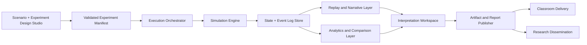
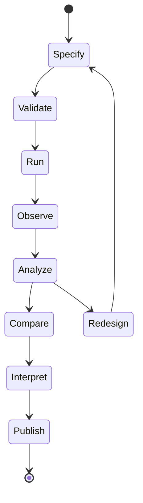
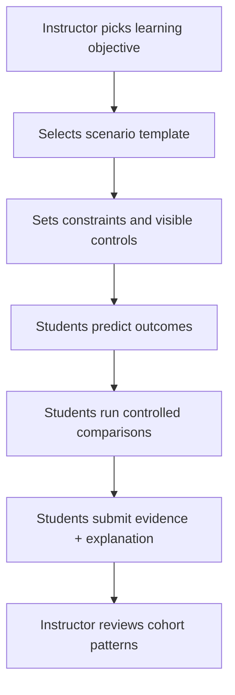
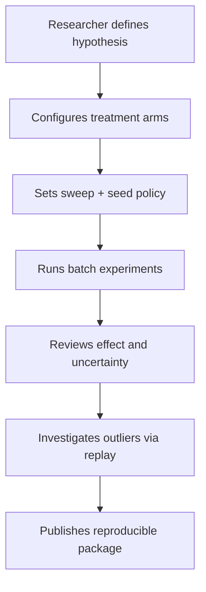

# Vision + Workflow Master Spec

**Status:** Review Draft  
**Version:** 0.2  
**Last Updated:** 2026-02-13  
**Scope:** Finished-product target state (not a status snapshot)

---

## 1. Purpose and Use

This document defines the intended end state of the Microecon product, including product identity, user outcomes, workflow architecture, system blueprint, and delivery guardrails.

It is self-contained by design: identity, terminology, scope boundaries, operating model, workflows, quality gates, and maintenance rules are all defined here.

It is designed to be read by:
- product owners
- simulation and platform engineers
- educators
- researchers
- collaborators and reviewers

This document should be used to:
- align roadmap decisions to the same finished-product target
- evaluate whether feature work advances educational and research value
- review scope without mixing "current state" constraints into long-term intent
- create implementation plans with clear acceptance gates
- onboard new collaborators without prerequisite reading
- resolve scope and terminology disputes from one canonical source

### Acceptance Criteria
- The document can be read independently and still convey the finished-product vision.
- The document distinguishes "target state" from "current implementation".
- The document provides actionable acceptance criteria for each major section.
- A new contributor can understand product intent, workflow model, and quality expectations using this file alone.

---

## 2. Product End-State Definition

Microecon is a mechanism-comparison laboratory for computational microeconomics, built for both educational exploration and research-grade inference.

At finished state, the product enables users to:
- specify institutions explicitly
- run controlled comparisons under fixed initial conditions
- inspect micro behavior and macro outcomes in one workflow
- generate reproducible evidence packages for sharing, teaching, and publication

The central product question remains:

**What difference does the institution make?**

### Acceptance Criteria
- Product language consistently frames Microecon as an institution-comparison platform.
- Both educational and research goals are first-class and supported in shared infrastructure.
- Reproducibility is treated as a default expectation, not an optional add-on.

### Scope Boundaries and Non-Goals

The finished product is explicitly designed for mechanism comparison in microeconomic settings.

Non-goals for this product scope:
- macroeconomic forecasting or policy calibration at national scale
- high-frequency continuous-time market microstructure realism
- heavy empirical calibration tied to one domain sector
- opaque black-box optimization with weak interpretability

### Acceptance Criteria
- Roadmap proposals can be screened against included non-goals.
- New work that falls outside scope is flagged before implementation.

### Core Terms Used in This Spec

1. Institution  
   A formal rule set that governs interaction, matching or clearing, bargaining or pricing, and observability.
2. Mechanism Comparison  
   Holding core initial conditions fixed while varying institutional rules to estimate outcome differences.
3. Experiment Manifest  
   A structured experiment definition containing objective, assumptions, mechanism settings, seeds, and run plan.
4. Run Record  
   The immutable result of one executed simulation run, with provenance metadata and log references.
5. Event Log  
   Ordered records of state transitions and interactions used for replay and analytics.
6. Analysis Record  
   Computed metrics and comparisons derived from run records under declared definitions.
7. Narrative Record  
   Human-readable claims linked to traceable evidence (metrics, events, replay bookmarks).
8. Publication Bundle  
   Portable package containing manifest, runs, analysis, and narrative for independent review.
9. Deterministic Reproducibility  
   Re-running a manifest under declared seed policy reproduces equivalent outputs under a documented tolerance policy.

### Acceptance Criteria
- Every major section uses terms consistent with this glossary.
- Product surfaces and reports can map back to these terms without ambiguity.

---

## 3. Value Model

### 3.1 Educational Value

The finished product helps learners move from intuition to mechanism-level explanation:
- see agent decisions as constrained optimization with incomplete information
- test institutional variants against identical endowments and preferences
- explain changes in welfare, distribution, and network structure
- learn to separate behavior assumptions from institutional effects

### 3.2 Research Value

The finished product supports theory-linked simulation research:
- define hypotheses as treatment comparisons
- run seeded batch experiments with parameter sweeps
- produce interpretable, auditable metrics
- export reproducible artifacts for review and replication

### 3.3 Platform Value

The finished product is a reusable foundation for future domains:
- modular institutional components
- stable experiment manifests and data contracts
- extensible analytics and reporting
- scenario packages for rapid reuse

### Acceptance Criteria
- Educational workflows include structured prompts, checkpoints, and interpretation support.
- Research workflows include batch execution, effect reporting, and reproducibility metadata.
- New institutional modules can be added without rewiring core user workflows.

---

## 4. Personas and Core Jobs

### 4.1 Instructor
- design lesson-ready scenarios
- control what students can modify
- compare cohort outputs quickly
- assess explanation quality and mechanism understanding

### 4.2 Student
- run guided experiments and counterfactuals
- inspect agent behavior and outcomes
- justify findings using evidence from logs and charts

### 4.3 Researcher
- formalize hypotheses and treatment arms
- execute robust sweeps and stress tests
- diagnose edge cases via replay and event trails
- produce publication-ready evidence bundles

### 4.4 Reviewer or Collaborator
- load shared experiment package
- verify manifest, seeds, and metrics
- replay key claims and validate interpretation

### Acceptance Criteria
- Each persona can complete full end-to-end tasks without requiring code edits.
- Shared artifacts are understandable across personas.
- Reviewer workflow can independently validate reported findings.

---

## 5. Finished-Product Capability Map

### Capability Groups

1. Design Studio  
   Define agents, environment, information regime, mechanism, and treatment arms.
2. Mechanism Library and Composer  
   Configure bargaining, matching or clearing, information, and friction modules as first-class components.
3. Live Simulation Workspace  
   Observe state, intervene safely, and inspect decisions in real time.
4. Comparison Lab  
   Run synchronized or asynchronous A/B comparisons with summary and diagnostic deltas.
5. Replay and Narrative Layer  
   Time-travel through key moments with linked state, events, and charts.
6. Analytics Layer  
   Compute welfare, efficiency, distribution, network, and stability metrics.
7. Artifact Publisher  
   Export reproducible bundles for education, collaboration, and publication.

### Acceptance Criteria
- All capability groups are accessible via coherent workflows, not isolated features.
- Mechanism modules are configurable from the product surface, not hard-coded paths.
- Outputs from live, comparison, replay, and analytics modes can be combined into one artifact.

---

## 6. End-to-End Workflow Architecture

### Workflow Stages

1. Specify  
   Define objective, mechanism variants, fixed controls, and success metrics.
2. Validate  
   Check manifest completeness, parameter bounds, and contract compatibility.
3. Run  
   Execute single or batch simulations with explicit seed policy.
4. Observe  
   Inspect state trajectories, decisions, and emergent patterns.
5. Analyze  
   Compute and review quantitative outcomes and diagnostics.
6. Compare  
   Evaluate institutional deltas under identical initial conditions.
7. Interpret  
   Connect observed differences to mechanism assumptions.
8. Publish  
   Package scenario, logs, metrics, and narrative claims for reuse.

### Acceptance Criteria
- Users can iterate from interpretation back to specification without losing provenance.
- Each stage records enough metadata to support replay and audit.
- Stage transitions are explicit and reversible where possible.

---

## 7. Dual-Track Operating Workflows

### 7.1 Educational Track

### Educational Workflow Spec

1. Instructor defines objective and scenario.
2. Platform generates guided assignment shell.
3. Student executes prescribed runs and optional extensions.
4. Platform captures metrics and evidence references automatically.
5. Student submits interpretation in structured natural language.
6. Instructor reviews class-level result distribution and misconceptions.

### Educational Acceptance Criteria
- Assignments can lock assumptions while still allowing meaningful exploration.
- Student submissions include traceable references to runs and metrics.
- Instructor can compare outcomes across students without manual data wrangling.

### 7.2 Research Track

### Research Workflow Spec

1. Researcher defines hypothesis and expected mechanism effect.
2. Researcher configures baseline and treatment manifests.
3. Platform executes deterministic batch runs with provenance capture.
4. Analytics reports effect sizes, dispersion, and sensitivity diagnostics.
5. Researcher inspects anomalies with synchronized replay plus event traces.
6. Platform exports complete artifact package.

### Research Acceptance Criteria
- Batch design supports robust sweeps with explicit provenance.
- Reported deltas always map to identifiable treatment definitions.
- Independent collaborator can reproduce key claims from exported artifacts.

---

## 8. Functional Architecture (Finished State)

### 8.1 Domain and Runtime Components

1. Agent Model  
   Private state, observable type, mutable holdings, optional beliefs, decision attributes.
2. Information Regime  
   Governs what agents can observe and what users can inspect.
3. Decision Procedure  
   Converts local information into actions with defined rationality model.
4. Matching or Clearing Protocol  
   Resolves who can trade with whom under explicit institutional rules.
5. Bargaining or Pricing Protocol  
   Determines terms of exchange for matched interactions.
6. Settlement and State Transition  
   Applies holdings updates and interaction state transitions with invariants.
7. Logging and Event Contracts  
   Emits canonical, replay-safe state and event streams.
8. Analytics and Interpretation  
   Computes outcomes and links evidence to mechanism assumptions.

### 8.2 Product Services

1. Experiment Manifest Service  
   Validation, versioning, and compatibility checks.
2. Execution Orchestrator  
   Single run, batch run, scheduling, and cancellation.
3. Replay Service  
   Indexed seek, event filtering, and narrative bookmarks.
4. Analytics Service  
   Metric generation, comparative summaries, and diagnostics.
5. Artifact Service  
   Export and import of reproducible experiment bundles.

### Acceptance Criteria
- Matching or clearing is a first-class swappable runtime component.
- One canonical schema powers live view, replay, analytics, and export.
- Services interoperate through versioned contracts with compatibility checks.

---

## 9. Data and Artifact Model

### 9.1 Core Artifacts

1. Experiment Manifest  
   Objective, assumptions, mechanism config, sweeps, seed policy, run budget.
2. Run Record  
   Runtime metadata, event stream pointer, summary metrics, integrity hash.
3. Analysis Record  
   Metric definitions, aggregation rules, comparative outputs, confidence metadata.
4. Narrative Record  
   Claims, linked evidence references, bookmarks, and explanation text.
5. Publication Bundle  
   Manifests, runs, analyses, narrative, and rendering assets.

### 9.2 Artifact Integrity Requirements

1. Provenance completeness  
   All outputs reference source manifest and run IDs.
2. Deterministic replay  
   Replaying a run recovers identical event ordering and state trajectory.
3. Metric traceability  
   Every chart value links to explicit metric definitions and data sources.

### Acceptance Criteria
- Users can export and re-import a full publication bundle without data loss.
- Artifact schema versions are explicit and backward-compatibility rules are documented.
- Integrity checks detect incomplete or corrupted bundles.

---

## 10. Analytics and Interpretation Framework

### 10.1 Outcome Families

1. Welfare and efficiency  
   Total welfare, gains from trade, unrealized surplus, convergence indicators.
2. Distribution and fairness  
   Utility dispersion, gain concentration, directional advantage by type.
3. Market process diagnostics  
   Trade frequency, match quality, refusal patterns, cooldown impacts.
4. Network dynamics  
   Centralization, reciprocity, persistence of trade relationships.
5. Mechanism sensitivity  
   Treatment effect size, parameter sensitivity, robustness maps.

### 10.2 Interpretation Standards

1. Distinguish causal claims from descriptive summaries.
2. Require mechanism-linked explanations for observed deltas.
3. Present uncertainty and sensitivity alongside point outcomes.
4. Flag conditions where interpretation confidence is low.

### Acceptance Criteria
- Analytics outputs are grouped by outcome family with consistent definitions.
- Comparative results include effect magnitude and uncertainty context.
- Narrative claims include links to supporting metrics and replay moments.

---

## 11. UX and Interaction Principles for Finished Product

1. Intent-first entry  
   Users begin with objective and question, not low-level parameter menus.
2. Progressive depth  
   Basic flows stay concise; advanced users can inspect full detail.
3. Explainability by design  
   Decisions, trades, and metric changes are inspectable with low friction.
4. Traceability in interface  
   Every displayed result has a "show source" path to evidence.
5. Shared language  
   UI terminology remains consistent across live, replay, comparison, and reports.

### Acceptance Criteria
- New users can complete a basic end-to-end run without external documentation.
- Advanced users can trace any result back to source events and configuration.
- The same conceptual model is preserved across all product modes.

---

## 12. Governance, Quality, and Reproducibility

### 12.1 Governance Rules

1. Mechanism semantics changes require document and contract updates.
2. Schema changes require explicit migration and compatibility policy.
3. Metrics changes require definitions, rationale, and impact notes.
4. New scenarios must declare intended learning or research objective.

### 12.2 Quality Gates

1. Determinism gate  
   Seeded reruns produce matching key outputs within tolerance policy.
2. Contract gate  
   Live payload, replay logs, and analytics inputs remain schema-consistent.
3. Interpretation gate  
   Reports include uncertainty and assumption statements.
4. Documentation gate  
   Product documentation and implementation-facing contracts stay synchronized.

### Acceptance Criteria
- Every release candidate passes determinism and contract checks.
- Documentation updates are coupled to behavior and schema changes.
- Published artifacts include assumptions and caveats by default.

---

## 13. Finished-Product Definition of Done

The platform is considered "vision-complete" when all statements below are true:

1. Institutional components are modular and swappable, including matching or clearing.
2. Educational and research tracks are both complete and stable.
3. Replay, analytics, and export operate on one canonical, versioned contract.
4. Batch comparison and sensitivity workflows are native product features.
5. Reproducible artifact packaging and validation are standard workflow steps.
6. Users can move from question to published evidence without writing code.
7. Independent collaborators can reproduce and audit key claims from shared bundles.

### Acceptance Criteria
- A representative education case and research case both complete end-to-end with no manual patching.
- External reviewer can verify a published claim from package import through replay.
- Product documentation provides a coherent, non-contradictory map of concepts and workflows.

---

## 14. Phase-Oriented Delivery Gates

This section defines outcome gates, not calendar dates.

### Gate A: Foundation Coherence
- Manifest and schema contracts stabilized.
- Live, replay, and analytics contract alignment complete.
- Matching or clearing protocol abstraction formalized.

### Gate B: Workflow Completeness
- End-to-end educational assignment workflow complete.
- End-to-end research batch workflow complete.
- Comparative analytics and narrative replay linkage complete.

### Gate C: Publication Readiness
- Artifact packaging and integrity validation complete.
- Import, audit, and rerun workflow complete for external collaborators.
- Report templates available for educational and research outputs.

### Acceptance Criteria
- Each gate can be validated with demo scenarios and documented pass criteria.
- Gate promotion requires evidence artifacts, not verbal status only.
- Deferred items are explicitly tracked with rationale and impact.

---

## 15. Open Design Questions

These are strategic questions to resolve during planning, without blocking use of this document.

1. Which matching or clearing families should define the initial institutional library?
2. What minimum uncertainty reporting standard is required for research outputs?
3. How much scenario authoring should be UI-driven versus file-driven?
4. What compatibility horizon should artifact schema versioning guarantee?
5. What is the minimal collaboration feature set for peer review workflows?

### Acceptance Criteria
- Open questions are tracked with owners and decision deadlines.
- Decisions are reflected in manifest schema, UI language, and documentation.
- Unresolved questions do not create hidden assumptions in released workflows.

---

## 16. Document Maintenance Policy

1. This file is the canonical source for finished-product vision and workflow intent.
2. Update this file when finished-product scope, workflows, terms, or acceptance gates change.
3. Any companion implementation notes, status reports, or technical architecture docs must not contradict this file.
4. Archive superseded exploratory drafts outside active document hierarchy.
5. Each update must record date, version increment, and rationale summary.

### Acceptance Criteria
- This document remains sufficient for product-level understanding without prerequisite reading.
- Contradictions between this spec and companion documents are treated as release blockers.
- Each update includes date, version increment, and short rationale.
